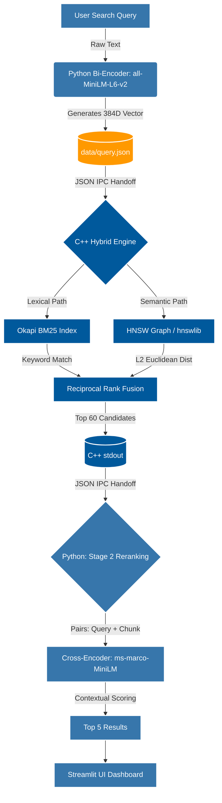

# ⚡ Neural-Sparse Fusion Engine (Dual-Stage RAG)


A high-performance, multi-document semantic search engine built entirely from scratch.

This project intentionally bypasses high-level AI wrappers (like LangChain) and cloud-hosted vector databases (like Pinecone) to implement a **custom C++ retrieval microservice** communicating with a **Python deep-learning frontend** via JSON Inter-Process Communication (IPC). It is designed to demonstrate full-stack systems engineering, memory management, and algorithm optimization on local CPU hardware.

---

## Key Features

- Hybrid Sparse + Dense Retrieval Pipeline
- Custom C++ Retrieval Microservice
- Python ↔ C++ JSON IPC Communication
- BM25 Lexical Search Engine
- HNSW Approximate Nearest Neighbor Search
- Cross-Encoder Neural Reranking
- Fully Local CPU-Based Execution
- Multi-Document Semantic Search
- Streamlit Interactive Dashboard

---

## System Architecture & Data Flow

Standard keyword searches fail to understand context, while standard vector searches often miss hyper-specific nouns. This architecture guarantees that both specific lexical keywords and ambiguous semantic queries are retrieved efficiently before being reranked by a deep neural network.



---

## Technical Approach

### 1. Embedding & Document Ingestion
Python reads large `.txt` files, generates 384-dimensional embeddings using a HuggingFace Bi-Encoder, and caches the processed chunks in memory to avoid redundant computation.

### 2. The IPC Bridge
Python serializes the user's query into JSON and hands it off to a compiled C++ binary running in a completely separate memory space.

### 3. Dual-Stage C++ Retrieval
The C++ microservice runs the query against two distinct indexes simultaneously:

- **Sparse Index (BM25):** Hunts for exact keyword matches (e.g., character names, dates).
- **Dense Index (HNSW):** Navigates a mathematical graph to retrieve semantically related contextual passages.

### 4. Mathematical Fusion (RRF)
C++ combines the scores from both indexes using Reciprocal Rank Fusion and sends the top candidates back to Python.

### 5. Deep Reranking
A Python Cross-Encoder neural network reranks the retrieved candidates by evaluating the semantic relationship between the query and each passage before returning the most relevant matches to the UI.

---

## Algorithmic Engine (Under the Hood)

### The Sparse Index (BM25)
Implemented in C++, BM25 performs probabilistic lexical ranking using term frequency, inverse document frequency, and document-length normalization.

### The Dense Index (HNSW Graph)
Semantic similarity is calculated using a Hierarchical Navigable Small World (HNSW) graph dynamically constructed in RAM via `hnswlib`. Distances are computed using the L2 (Euclidean) metric across a 384-dimensional space:

$$d(p, q) = \sqrt{\sum_{i=1}^n (q_i - p_i)^2}$$

### Reciprocal Rank Fusion (RRF)
To bridge the "Lexical Gap," the C++ engine mathematically merges the BM25 and HNSW results using the RRF algorithm:

$$RRF = \frac{1}{k + R_{BM25}} + \frac{1}{k + R_{HNSW}}$$

---

## JSON IPC Protocol (Internal API)

Because Python and C++ run in completely separate memory spaces, they communicate strictly through serialized JSON.

**Python → C++ Payload** (`data/query.json`):
```json
{
  "text": "the existential realization that nature is indifferent",
  "vector": [0.012, -0.045, 0.881, 0.334]
}
```

**C++ → Python Response** (stdout):
```json
[
  {
    "final_rank": 1,
    "rrf_score": 0.0315,
    "bm25_rank": 45,
    "hnsw_rank": 2,
    "text": "Before him is a dead sea that stretches in azure calm..."
  }
]
```

---

## Quick Start (Local Setup Guide)

### 1. Clone the repository
```bash
git clone https://github.com/rounaktiwari27/Neural-Sparse-Fusion-Engine.git
cd Neural-Sparse-Fusion-Engine
```

### 2. Run the automated build script
This script isolates the Python environment, installs dependencies, and compiles the C++ microservice with `-O3` optimization for maximum CPU performance.
```bash
chmod +x setup.sh
./setup.sh
```

### 3. Launch the UI Dashboard
```bash
source venv/bin/activate
streamlit run app.py
```

---

## Architectural Evaluation & Roadmap

### System Merits

- **Improved semantic retrieval for abstract queries:** The dense vector HNSW graph maps abstract themes to contextual paragraphs without relying on exact keywords.
- **Resilient Memory Management:** Dynamic `st.session_state` locking allows massive multi-document ingestion without crashing the Streamlit UI.
- **Blazing Fast Local Execution:** The C++ binary enables highly efficient approximate nearest-neighbor search on local CPU hardware.

### Engineering Bottlenecks (Future Scaling)

- **Dynamic Graph Latency:** The C++ engine currently rebuilds the HNSW graph dynamically in RAM from scratch for every search. Production systems must serialize this graph to a `.bin` file for $O(1)$ memory loading to achieve sub-second latency.
- **Model Dimensionality Limits:** The system uses a 384-dimensional MiniLM model to allow local CPU execution. Higher-capacity embedding models could further improve semantic retrieval quality at the cost of increased memory and compute usage.
- **Cloud Hosting Constraints:** Deploying this architecture on low-memory free-tier cloud environments may lead to Out-Of-Memory (OOM) issues because the vector graph and embedding models are loaded directly into RAM.

## Demo Video

Watch the project demo here:  
https://drive.google.com/drive/folders/1yys2Qu51bVy6eyIwXOOof7j8NCddDCy8

